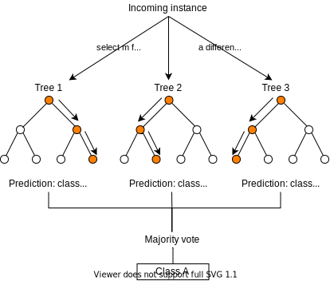
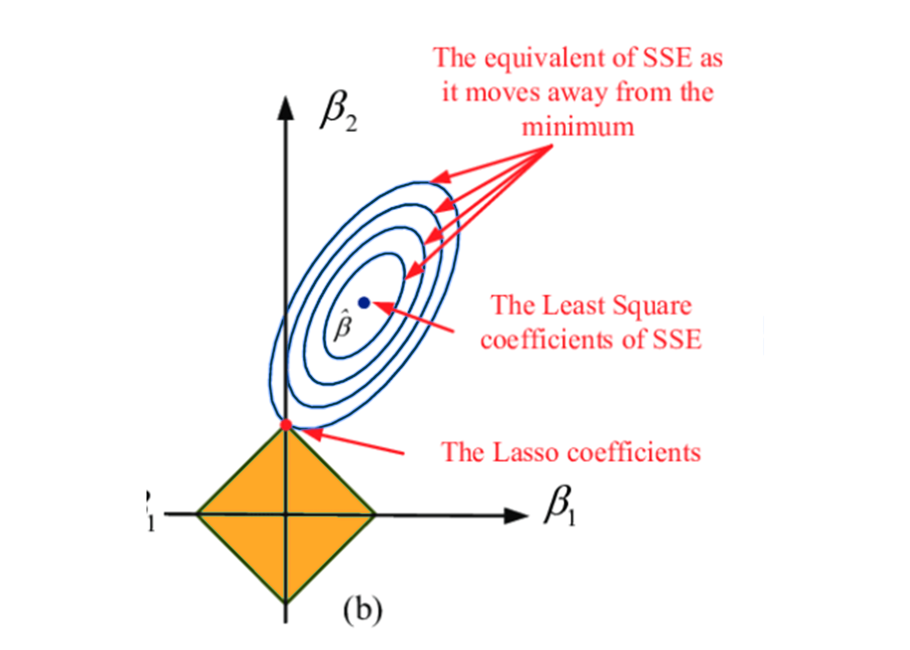

```{r setup, include=FALSE}
knitr::opts_chunk$set(echo = TRUE, warning = FALSE, message = FALSE) 
```

# Introduction

The objective of this project is to construct a machine learning algorithm capable of accurately forecasting the musical genre classification of a given song.

## Data Description

This project will utilize a dataset sourced from Spotify's API via the `spotifyr` package, encompassing a diverse range of songs spanning multiple genres. Leveraging this data, the research will implement various techniques to develop a high-performing multiclass classification model.

## What is Music Genre?

{fig-align="left" width="294"}

Music genre refers to a method of classifying music based of its particular stylistic elements, structural features, and cultural origins. This categorization scheme is based on a diverse range of factors including, but not limited to, rhythmic patterns, melodic components, harmonic structures, and instrumentation choices. Common examples of popular music genres include pop, rock, rap, r&b, latin, and country. Each genre is characterized by its unique sonic qualities, rhythmic patters, and instrumental arrangements, which serve to distinguish it from other genres.

## Why?

The ability to predict the genre of a song holds significant utility for music enthusiasts seeking to explore novel music. Given the vast and ever-expanding pool of songs available, identifying songs that align with one's musical preferences can prove to be a daunting task. In this regard, a genre prediction model serves as a valuable tool for users to effectively sieve through songs by their preferred genre, thereby facilitating the discovery of fresh music. Moreover, the model holds potential for integration into music recommendation systems, enabling the provision of tailored suggestions based on users' listening histories and preferences.

# Exploratory Data Analysis

## Loading Packages and Data

We will begin by loading all the necessary software packages and the raw dataset that will be utilized in this project.

```{r}
require(tidyverse)
require(tidymodels)
require(spotifyr)
require(dplyr)
require(tidymodels)
require(readr)
require(kknn)
require(ISLR)
require(corrr)
require(corrplot)
require(randomForest)
require(formattable)
require(rpart.plot)
require(ggplot2)
require(rsample)
require(tune)
tidymodels::tidymodels_prefer()
```

```{r}
library(readr)
playlist_songs <- read_csv("/Users/ashleyson/Desktop/Music-Genre-Classification/data/genre_songs.csv")
feature_names <- names(playlist_songs)[12:23]
glimpse(playlist_songs, width = 60)
```

## Describing the Predictors

`track.id`: Song ID (character)

`track.name`: Song Name (character)

`track.artist`: Song Artist (character)

`track.popularity`: Song populary, (0-100), higher the more popular (double)

`track.album.id`: Album ID (character)

`track.album.release_date`: Album release date (character)

`playlist_name`: Playlist Name (character)

`playlist_id`: Playlist ID (character)

`playlist_genre`: Playlist genre (character)

`playlist_subgenre`: Playlist subgenre (character)

`danceability`: How suitable a track is for dancing based on the musical features of the song including rhythm and tempo. 0.0 being lest danceable and 1.0 being most danceable. (double)

`energy`: A measure from 0.0 to 1.0 that represents a perceptual measure of intensity and activity. Typically, energetic tracks feel fast, loud, and noisy. Perceptual features contributing to this attribute include dynamic range, perceived loudness, timbre, onset rate, and general entropy. (double)

`key`: The estimated overall key of the track. Integers map to pitches using standard Pitch Class notation . E.g. 0 = C, 1 = C♯/D♭, 2 = D, and so on. If no key was detected, the value is -1. (double)

`loudness`: The overall averaged loudness of a track in decibels (dB). Measured with the quality of a sound that is the primary psychological correlate of physical strength (amplitude). Values typical range between -60 and 0 db. (double)

`mode`: The modality (major or minor) of a track, the type of scale from which its melodic content is derived. Major is represented by 1 and minor is 0. (double)

`speechieness` The presence of spoken words in a track. The 1.0 being most speechiness. Values above 0.66 describe tracks that are probably made entirely of spoken words. Values between 0.33 and 0.66 describe tracks that may contain both music and speech, either in sections or layered, including such cases as rap music. Values below 0.33 most likely represent music and other non-speech-like tracks. (double)

`acousticness`: A value ranging from 0.0 to 1.0 of whether the track is acoustic. The higher the value the higher confidence the track is acoustic. (double)

`instrumentalness`: Predicts whether a track contains no vocals. "Ooh" and "aah" sounds are treated as instrumental in this context. Rap or spoken word tracks are clearly "vocal". The closer the instrumentalness value is to 1.0, the greater likelihood the track contains no vocal content. Values above 0.5 are intended to represent instrumental tracks, but confidence is higher as the value approaches 1.0. (double)

`liveness`: Detects the presence of an audience in the recording. Higher liveness values represent an increased probability that the track was performed live. A value above 0.8 provides strong likelihood that the track is live. (double)

`valence`: A measure from 0.0 to 1.0 describing the musical positiveness conveyed by a track. Tracks with high valence sound more positive (e.g. happy, cheerful, euphoric), while tracks with low valence sound more negative (e.g. sad, depressed, angry). (double)

`tempo`: The overall estimated tempo of a track in beats per minute (BPM). In musical terminology, tempo is the speed or pace of a given piece and derives directly from the average beat duration. (double)

`duration_ms`: Duration of song in milliseconds (double)

## Tidying the Raw Data

Let's take a look at the raw data set in order to perform necessary data cleansing procedures.

```{r}
head(playlist_songs)
dim(playlist_songs)
colnames(playlist_songs)
```

Upon examination of the dimensions and variable nomenclature of the data set, it appears that there exist 31,390 data points and 23 distinct features. It is imperative that the presence of any missing values (NA) be thoroughly assessed to avoid impeding data analysis and compromising the accuracy of any subsequent descriptive statistics.

```{r}
sum(is.na(playlist_songs) == "TRUE")
which(is.na(playlist_songs), arr.ind = TRUE)
```

It appears that the dataset is devoid of any missing values, which is a positive indication. We will now inspect whether any songs have a duration shorter than 4 seconds and subsequently removing them from the data set.

```{r}
playlist_songs <- filter(playlist_songs, playlist_songs$duration_ms>4000)
```

Having ensured the integrity of our processed data, we can now proceed to investigate and compare the various audio characteristics by genre. Let us begin by examining the distribution of observations among the different music genres.

## Distribution

```{r}
distributionplot <- ggplot(data = playlist_songs, aes(y=playlist_songs$playlist_genre)) +
  geom_bar(aes(fill=playlist_songs$playlist_genre)) +
  scale_fill_manual(values = c("violetred2", "lightcoral", "pink", "burlywood4","darkseagreen4", 'lavenderblush3')) +
  theme (plot.title = element_text(hjust = 0.5)) +
  expand_limits(x = 8500) +
  labs(title = "Music genres - Distribution of Observations between Genres",
                 y = "Genres",
                 x = "Count",
       fill = 'Playlist Genres') +
  geom_text(stat='count', 
            aes(label = sprintf('%s (%.1f%%)', 
                after_stat(count), 
                after_stat(count / sum(count) * 100))),
            hjust=ifelse(1.5, -0.1, 1.1))

distributionplot
```

Observing the distribution of data, it is apparent that the data set is relatively balanced, thereby obviating concerns pertaining to imbalanced data. Subsequently, we will proceed to examine the data density.

### Density

```{r}
playlist_songs %>%
  select(c('playlist_genre', feature_names)) %>%
  pivot_longer(cols = feature_names) %>%
  ggplot(aes(x = value)) +
  geom_density(aes(color = playlist_genre), alpha = 0.5) +
  scale_color_manual(values = c("violetred2", "lightcoral", "pink", "burlywood4","darkseagreen4", 'lavenderblush3')) +
  facet_wrap(~name, ncol = 3, scales = 'free') +
  labs(title = 'Spotify Audio Feature Density - by Genre',
       x = '', y = 'density') +
  theme(axis.text.y = element_blank()) 
```

Upon examining the density plots of the audio features, it becomes apparent that the data set showcases a proclivity towards low `acousticness`, `liveness`, `instrumentalness`, and `speechiness` scores, while exhibiting higher `danceability`, `energy`, and `loudness` values. However, the `valence` metric, which measures the degree of positive or negative emotion conveyed by a track, demonstrated a significant variance across the different genres. Notably, the `edm` genre was characterized by its marked lack of `acousticness` and high `energy`, low `valence` (emotive negativity) features.

Conversely, `latin` tracks displayed high `valence` and `danceability` attributed. `rap` songs shows high `speechiness` and `danceability` scores, while `rock` songs were most likely to be recorded live and demonstrated low `dancebility` metrics. Furthermore, it was observed that the duration of `pop`, `latin`, and `edm` songs tended to be shorter in comparison to `r&b`, `rap`, and `rock` genres.

Based on the density plot analysis, it appears that `energy`, `valence`, `tempo`, and `danceability` scores may offer better potential for differentiating between various music genres, whereas `instrumentalness` and `key` metircs may not be as effective in this regard.

### Outliers

Certain data points in the data set possess `durations` that are significantly divergent from the norm. Such irregularities could potentially exert an adverse impact on our subsequent analyses. Thus, we have elected to exclude these anomalous values from our data set and concentrate our attention on the remaining observations. To detect such outliers, we will utilize the `boxplot` function, which effectively identifies any data points that exceed a specific range. Ordinarily, this range is set to the interquartile range, which accounts for the central 50% of the data. However, given the disproportionate quantity of outliers in our data set, we will augment the range parameter to '5'. This increase serves to expand the range by four times the interquartile range, thereby enabling us to detect a broader spectrum of data points that are deemed to be outliers.

```{r}
with_outliers <- playlist_songs %>%
  ggplot(aes(y = duration_ms)) +
  geom_boxplot(fill = 'pink') +
  coord_flip() +
  
  labs(title = 'Duration') 
duration_outliers <- boxplot(playlist_songs$duration_ms, 
                             plot = FALSE, range = 5)$out
playlist_songs_no_outliers <- playlist_songs %>%
  filter(!duration_ms %in% duration_outliers) 
without_outliers <- playlist_songs_no_outliers %>%
  ggplot(aes(y = duration_ms)) +
  geom_boxplot(fill = 'pink') +
  coord_flip() +
  labs(title = 'Duration, outliers removed') 
gridExtra::grid.arrange(with_outliers, without_outliers, ncol = 1)
```

After identifying and eliminating the statistical outliers, the resultant data set is compromised of 131 songs, which are identified as possessing either exceptionally length or abbreviated durations. As a direct consequence of the aforementioned procedure, the maximum song duration within the data set was found to be around 8.6 minutes, as opposed to the initial maximum of 85 minutes.

### Correlations

We will now examine the interrelationships and potential correlations among the various features in the data set.

```{r}
playlist_songs_no_outliers %>%
  select(feature_names) %>%
  scale() %>%
  cor() %>%
  corrplot::corrplot(method = 'color', 
                     order = 'hclust', 
                     type = 'upper', 
                     diag = FALSE, 
                     tl.col = 'black',
                     addCoef.col = "grey30",
                     number.cex = 0.6,
                     main = 'Audio Feature Correlation',
                     mar = c(2,2,2,2),
                     family = 'Avenir',
                     col = c('darkseagreen4', 'lavender', 'violetred2'))
```

After examining the data set encompassing a diverse array of songs and genres, we observed a notable positive correlation of 0.68 between `energy` and `loudness`. Despite this, we opted to exclude the `loudness` attribute, as `energy` exhibited more prominent discrepancies between various genre clusters, as demonstrated by the density plot.

Moreover, we noted an anticipated negative correlation between `energy` and `acousticeness`. and `energy` and `key`. We also detected a positive correlation between `danceability` and `valence`, which implies that cheerful compositions tend to elicit a greater proclivity for dance among listeners.

We will now proceed with the removal of `loudness` from the dataset.

```{R}
feature_names_reduced <- names(playlist_songs)[c(12:14,16:23)]
```

We will now determine the median feature value associated with each musical genre in order to establish correlations and discern any potential similarities between them.

```{r}
# average features by genre
avg_genre_matrix <- playlist_songs_no_outliers %>%
  group_by(playlist_genre) %>%
  summarise_if(is.numeric, median, na.rm = TRUE) %>%
  ungroup() 
avg_genre_cor <- avg_genre_matrix %>%
  select(feature_names_reduced, -mode) %>% 
  scale() %>%
  t() %>%
  as.matrix() %>%
  cor() 
colnames(avg_genre_cor) <- avg_genre_matrix$playlist_genre
row.names(avg_genre_cor) <- avg_genre_matrix$playlist_genre
avg_genre_cor %>% corrplot::corrplot(method = 'color', 
                     order = 'hclust',
                     type = 'upper',
                     tl.col = 'black',
                     diag = FALSE,
                     addCoef.col = "grey40",
                     number.cex = 0.75,
                     mar = c(2,2,2,2),
                     main = 'Correlation Between Median Genre Feature Values',
                     family = 'Avenir',
                     col = c('darkseagreen4', 'lavender', 'violetred2'))
```

We can see that **`R&B`** and **`EDM`** genres have a negative correlation with all other genres in the dataset, except for each other, which suggests that they are relatively distinct from other genres but not from each other.

Among all genres, **`Latin`** and **`R&B`** are the most similar, with a positive correlation of 0.57, indicating that they have similar median feature values. In contrast, **`EDM`** and **`R&B`**, as well as **`EDM`** and **`Latin`**, have the largest differences among all pairs of genres, with negative correlations of -0.83 and -0.69, respectively.

# Setting up Models

At this stage, we will proceed with configuring our models by implementing a train/test splitting approach, constructing a comprehensive recipe, and implementing cross-validation methodologies to enhance the efficacy of our models.

{width="318" height="246"}

## Preparing the data for training

```{r}
playlist <- playlist_songs_no_outliers %>%
  mutate_if(is.numeric, scale)
playlist$mode <- as.factor(playlist$mode)
playlist$key <- as.factor(playlist$key)
```

## Train/Test Split

```{r}
set.seed(1234)
playlist_split <- initial_split(playlist, prop = 0.75,
                               strata = playlist_genre)
playlist_train <- training(playlist_split)
playlist_test <- testing(playlist_split) 
```

```{r}
dim(playlist_test)
```

```{r}
dim(playlist_train)
```

Presently, the training data set is comprised of 23,487 instances, while the testing data encompasses 7,831 observations. The magnitude of these data subsets is deemed suitable for the development of an effective model.

## Building Our Recipe

As we will be utilizing identical predictors, response variable, and model conditions, we plan to create a single recipe that all our models will use. The recipe will incorporate 11 predictor variables: `danceability`, `energy`, `key`, `mode`, `speechiness`, `acousticness`, `instrumentalness`, `liveness`, `valence`, `tempo`, and `duration_ms`. We will exclude any ID variables used to identify individual songs since they are not relevant for predicting `playlist_genre`.

We will treat `mode` and `key` as categorical variables and convert them into dummy variables. Additionally, we will standardize our data by centering and scaling it to optimize model performance. It is worth noting that identifying the individual songs has no bearing on the model's accuracy.

```{r}
music_recipe <- recipe(playlist_genre ~ danceability + energy + key + mode + speechiness + acousticness + instrumentalness + liveness + valence + tempo + duration_ms ,
                         data = playlist_train) %>%
  step_naomit(all_predictors()) %>%
  step_scale(all_numeric_predictors()) %>%
  step_center(all_numeric_predictors()) %>%
  step_dummy(mode) %>%
  step_dummy(key)
```

## K-Fold Cross Validation

In order to ensure that the model performance estimates are reliable and generalize well to new, unseen data, we will employ a technique called stratified cross-validation. Our cross-validation strategy will be stratified on the response variable, `playlist_genre`.

```{r}
playlist_folds <- vfold_cv(playlist_train, v = 10, strata = playlist_genre)
```

```{r}
save(playlist_folds, music_recipe, playlist_train, playlist_test, file = "/Users/ashleyson/Desktop/Playlist-Modeling-Setup.rda")
```

# Model Building

Our next step will be to construct our models using the recipe previously established. Due to varying computational times for each model, a separate qmd file has been prepared and can be accessed via the following URL: [**https://github.com/ashleyson/Music-Genre-Classification/tree/main/models**](https://github.com/ashleyson/Music-Genre-Classification/tree/main/models), housed within the models folder.

We will begin by specifying the type of model, defining its engine, and setting its mode as classification. Following this, we will establish our workflow, add the new model, and integrate the recipe we established.

We will build four models, specifically Decision Tree, Random Forest (RF), Quadratic Discriminant Analysis (QDA), and LASSO regression models, using the previously defined recipe.

To refine and optimize our models, we will construct a tuning grid that includes the parameters to be fine-tuned, along with the number of distinct tuning levels. The model will subsequently be tuned using the selected parameters. After selecting the most accurate model from all the tuning processes, we will finalize our workflow using those tuning parameters.

Subsequently, we will fit our model to the training dataset and save the results to an RDA file to prevent the need for repeated analyses.

# Model Results

To effectively assess the efficacy of our machine learning model, we have elected to employ the `roc_auc` metric.

This evaluation method quantifies the area under the curve (AUC) for the receiver operating characteristic (ROC) curve, which provides a visual depiction of a binary classifier system's capacity to differentiate between positive and negative classes as the decision-making threshold is altered. By utilizing the roc_auc metric, we can obtain a more thorough evaluation of the model's performance, particularly in instances where the data may be imbalanced.


While accuracy can be a valuable metric for model evaluation, it may not provide a comprehensive assessment of the model's overall efficacy, particularly when confronted with imbalanced data. Our focus on the roc_auc metric enables us to obtain a more nuanced understanding of the model's classification capabilities and make informed decisions regarding its performance.

To this end, we have implemented four distinct models as part of our analysis: Quadratic Discriminant Analysis (QDA) , Lasso Regression, Decision Tree, and Random Forest (RF)

```{r}
load("/Users/ashleyson/Desktop/Music-Genre-Classification/RDA/Playlist-Modeling-Setup.rda")
load("/Users/ashleyson/Desktop/Music-Genre-Classification/RDA/Playlist_Random_Forest.rda")
load("/Users/ashleyson/Desktop/Music-Genre-Classification/RDA/Playlist-DecTree-Model.rda")
load("/Users/ashleyson/Desktop/Music-Genre-Classification/RDA/Playlist_QDA.rda")
load("/Users/ashleyson/Desktop/Music-Genre-Classification/RDA/Playlist_LASSO.rda")
```

## Visualizing our Results

The R programming language's `autoplot` function represents a crucial resource for visualizing the outcomes of fine-tuned models. With this tool, we can render graphical representations of the effect of parameter alterations on our metric of choice, which, in this particular case, is `roc_auc`.

To optimize the use of space, we will only present the visualizations of models that exhibit the top three ROC AUC values within the forthcoming section. This approach will enable us to scrutinize and highlight the most auspicious models in greater detail.

### Random Forest

The random forest model is a powerful supervised ensemble learning technique that comprises of multiple decision trees. While decision tree models may often overfit to the training data, the random forest algorithm overcomes this limitation by averaging the prediction results of each decision tree and determining a final output.

By stacking multiple classifiers together, the random forest algorithm improves its overall performance and generates more accurate predictions. This technique ensures that the model is more robust and less prone to errors, making it an effective tool for various machine learning tasks.



Within the context of our random forest mode, we are engaged in the process of fine_tuning three distinct hyper parameters. These parameters include `tree`, which represents the number of trees within the random forest mode, `mtry`, which denotes the quantity of predictors that will be sampled at a random model creation, and `min_n`, which is indicative of the minimum quantity of data values necessary for a tree node to be eligible for further splitting.

Following an evaluation of the ROC AUC scores, it becomes evident that such scores fluctuate considerably based on the number of trees present within the model. However, the overall trend indicates that a greater quantity of trees typically results in a higher ROC AUC score. Notably, the optimal node size was determined to be 8, as illustrated within the bottom plot, and was paired with a model configuration consisting of 10 trees and 7 randomly selected predictors.

```{r}
autoplot(playlist_rf_tune_res_auc)
```

### Decision Tree

The decision tree algorithm represents a widely-used technique in supervised learning, whereby a tree-like model is generated. Though decision trees are intuitive and easily comprehensible, they may suffer from overfitting on the training data and a lack of generalizability to new data.

To mitigate these concerns, strategies such as tree pruning and maximum depth constraints can be employed. Furthermore, ensemble learning methods, such as random forests, can bolster the performance of decision tree models by amalgamating multiple decision trees.

{width="465"}

By harnessing decision tree algorithms and incorporating these aforementioned techniques, we can develop robust models that are adept at forecasting outcomes across a diverse array of machine learning problems.

```{r}
autoplot(playlist_dt_tune_res)
```

### LASSO Regression

LASSO Regression constitutes a formidable regularization technique which facilitates the simplification of linear regression models by compressing the coefficients of insignificant features to zero. This process mitigates the problem of overfitting and enhances the generalization capabilities of the model.

The inclusion of a penalty term grounded on the L1-norm of the coefficients empowers the LASSO Regression algorithm to efficiently identify and eliminate redundant features. This cultivates model transparency and reduces the likelihood of overfitting, particularly in datasets with a high number of dimensions.

{width="425"}

LASSO Regression has become an extensively utilized approach in machine learning, particularly when confronted with sparse datasets or those that involve numerous features relative to the number of observations. By integrating LASSO Regression into our machine learning framework, we can construct models that are more precise and resilient, capable of accurately discerning the latent trends in the data.

```{r}
autoplot(playlist_lasso_tune_res)
```

## Model Accuracies

To effectively synthesize the optimal `roc_auc` outcomes of our four models utilized, we will generate a consolidated tibble to present the projected final `roc_auc` value for each model.

```{r}
best_resamples <- 
  bind_rows(
            show_best(playlist_rf_tune_res_auc, metric = "roc_auc", n = 1) %>% mutate(model = "Random Forest") %>% select(model, roc_auc = mean),  
            show_best(playlist_dt_tune_res, metric = "roc_auc", n = 1) %>% mutate(model = "Decision Tree") %>% select(model, roc_auc = mean), 
            show_best(playlist_lasso_tune_res, metric = "roc_auc", n = 1) %>% mutate(model = "LASSO Regression") %>% select(model, roc_auc = mean),
             show_best(playlist_qda_kfold_fit, metric = "roc_auc", n = 1) %>% mutate(model = "Quadratic Discriminant Analysis") %>% select(model, roc_auc = mean)
  )

best_resamples %>% 
  dplyr::arrange(desc(roc_auc)) 

```

# Results from our Best Models

Having determined that the random forest model performed optimally, we will now proceed with the comprehensive analysis of its outcomes.

## And the Best Model is...

Random Forest 444! After evaluating the performance of different prediction models, our findings indicate that Random Forest model #444 exhibited the highest level of performance relative to all other employed random forest models, and even surpassed the efficacy of alternative prediction models. Below, we present the model's output and scores, as well as a comprehensive breakdown of its associated parameters.

```{r}
show_best(playlist_rf_tune_res_auc, metric = "roc_auc") %>%
  select(-.estimator, .config) %>%
  slice(1)
```

Having established that the random forest model exhibits the most favorable performance overall, we need to assess its ability to generalize to new and unseen data. Although the impressive ROC AUC scores achieved during the training phase suggest the model's exceptional performance on the data utilized for training, it is crucial to verify whether the model can sustain this level of efficacy when confronted with fresh and unobserved data.

## Final ROC AUC Results

```{r}
final_rf_model_test <- augment(playlist_rf_final_fit_auc , 
                                playlist_test) %>% 
  select(playlist_genre, starts_with(".pred"))

roc_data <- final_rf_model_test %>% 
  dplyr::select(starts_with(".pred_"))

roc_curve(roc_data, truth = .pred_class, .pred_edm, .pred_latin, .pred_pop, .pred_rap, 
          `.pred_r&b`, .pred_rock) %>% 
  # Plot the ROC curve
  autoplot()
```

Given that this is a problem of multiclass classification, it follows that there exists a distinct `roc_auc` curve for each musical genre. Therefore, it is pertinent to visually scrutinize each individual curve.

## Why is this happening?

Upon examining the ROC curve, it appears that for the EDM, Latin, Pop, and Rock classes, the curve touches the left corner, indicating that the model is achieving high specificity for these classes. This suggests that the model is doing a good job of distinguishing these genres from the others, but it may be sacrificing sensitivity in the process, potentially leading to missed positive cases.

Conversely, the ROC curve for the Rap and R&B classes follows the center linear line, suggesting that the model is performing no better than random guessing for these classes. There could be several reasons for this. One possible reason could be inherent difficulty in predicting these genres. It's also possible that the similarities between the Rap and R&B genres could be contributing to the lower performance of the random forest model for those classes.

# Conclusion

After fitting and analyzing four distinct models, it was observed that the random forest model exhibited the most promising results in predicting the genre of a song, while the quadratic discriminant analysis model demonstrated the poorest performance. The superiority of the random forest algorithm over the quadratic discriminant analysis algorithm in multi-class classification problems may be attributed to several factors, including the ability of random forest models to model non-linear relationships, handle missing values, identify feature importance, and prevent overfitting.

Although the random forest model performed well in predicting certain genres, such as pop, latin, edm, and rock, it struggled to accurately predict rap and R&B genres. This limitation may be attributed to various factors, including the subtle differences in audio features between these genres and the choice of classification algorithm and audio features. Therefore, further experimentation with different models and features may be necessary to enhance the model's predictive power for these genres.

To address the poor predictive performance for rap and R&B genres, it may be beneficial to merge these two genres into a single category, which could increase sample size and reduce classification complexity. However, this approach should be considered with caution, as it may lead to information loss and potential biases.

Future work will involve exploring the reasons behind the model's poor performance in predicting rap and R&B genres. This investigation will involve examining the similarities and differences in the respective audio features of these genres. Additionally, expanding the range of genres analyzed may offer further insights into the model's ability to distinguish between different music genres and its limitations.

In conclusion, this project has provided an opportunity to develop machine learning and data analysis skills while investigating the relationship between music and machine learning. While the random forest model may not have achieved perfect accuracy, the study findings have demonstrated the potential of machine learning algorithms to predict song genres based on audio features. This study has provided new insights for music producers, record labels, and music enthusiasts in identifying key audio features that define and distinguish various music genres.

{width="687"}

{width="287"}
